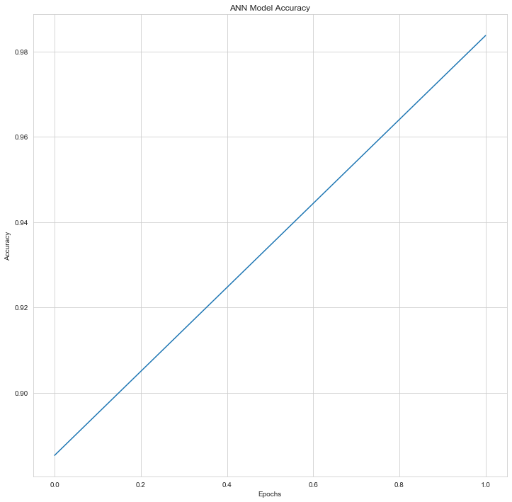
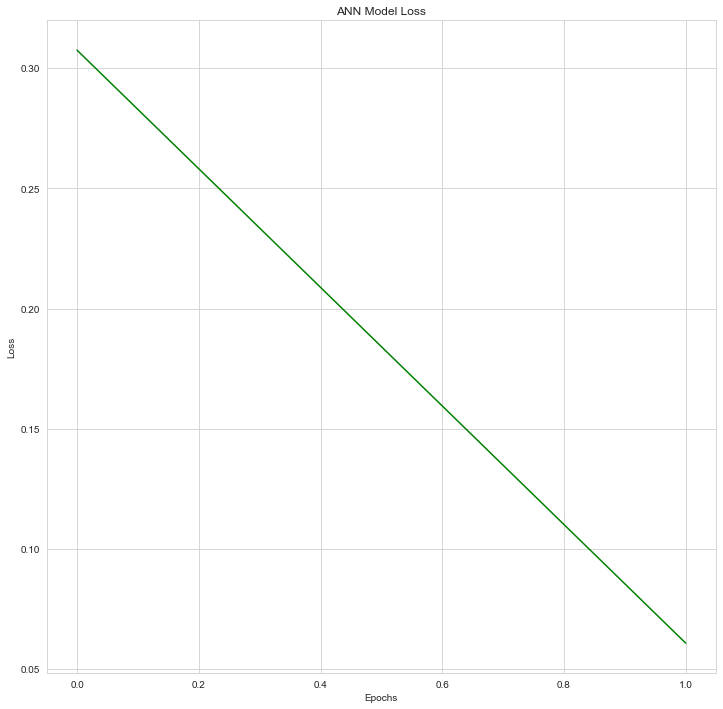

#  Multiclass Classification (Paper-Rock-Scissors) with CNN-2D

## Problem Statement

The purpose of the task is **classify paper, rock and scissor** from hand pictures using supervised machine learning methods (CNNs). With the model trained through pictures, it was tried to predict that the picture in hand was **rock, paper or scissors.**

## Dataset

The dataset was downloaded from the [Kaggle](https://www.kaggle.com/sanikamal/rock-paper-scissors-dataset). There are a total of **372 different pictures in 3 different folders (classes)** in the ***test*** file. In the ***train*** file, there are **3 different folders** representing 3 different classes and a total of **2520 pictures**. **If you want to get train and test folders, please click on the Kaggle link and download it. You need to sign in to Kaggle to download them.**

## Methodology

For understanding the methodology you are free to visit the [CNN Explainer](https://poloclub.github.io/cnn-explainer/) website. 

## Analysis

| Layer (type)    | Output Shape |  Param # |
|--|--|--|
| conv2d_1 (Conv2D) | (None, 62, 62, 32) | 896
| max_pooling2d_1 (MaxPooling2 | (None, 31, 31, 32)    | 0
| conv2d_2 (Conv2D) | (None, 29, 29, 32)  | 9248
| max_pooling2d_2 (MaxPooling2) | (None, 14, 14, 32)  | 0
| flatten_1 (Flatten)  | (None, 6272)  | 0
| dense_1 (Dense)   | (None, 128) | 802944
| dense_2 (Dense)   | (None, 3)   | 129 

> **Total params:** 813,217
> **Trainable params:** 813,217
> **Non-trainable params:** 0

---

### Plotting Artificial Neural Networks Accuracy and Loss 

**Model Accuracy**

**Model Loss**

---

### Prediction

The system was tested on **9 different photos representing 3 different classes in the** ***validation folder***. The first column represents the paper, the second column represents the stone, and finally the third column represents the scissors. The accuracy of guessing paper is **0.6666**, and that of rock and scissors is **1.0**.

***Prediction of paper class:***

> [[0. 1. 0.]] 
> [[1. 0. 0.]] 
> [[0. 0. 1.]] 
> [[0. 0. 1.]] 
> [[1. 0. 0.]] 
> [[1. 0. 0.]] 
> [[1. 0. 0.]] 
> [[1. 0. 0.]] 
> [[1. 0. 0.]]

***Prediction of rock class:***

> [[0. 1. 0.]] 
> [[0. 1. 0.]] 
> [[0. 1. 0.]] 
> [[0. 1. 0.]] 
> [[0. 1. 0.]] 
> [[0. 1. 0.]] 
> [[0. 1. 0.]] 
> [[0. 1. 0.]] 
> [[0. 1. 0.]]

***Prediction of scissors class:***

> [[0. 0. 1.]] 
> [[0. 0. 1.]] 
> [[0. 0. 1.]] 
> [[0. 0. 1.]] 
> [[0. 0. 1.]] 
> [[0. 0. 1.]] 
> [[0. 0. 1.]] 
> [[0. 0. 1.]] 
> [[0. 0. 1.]]

**Took 1.2296628952026367 seconds to classificate objects.**

## How to Run Code

Before running the code if you don't have all the necessery libraries, you need to have these libraries:

 - keras 
 - numpy 
 - warnings 
 - sklearn
 - time
 - seaborn
 - matplotlib
    
## Contact Me

If you have something to say to me please contact me: 

 - Twitter: [Doguilmak](https://twitter.com/Doguilmak)  
 - Mail address: doguilmak@gmail.com
